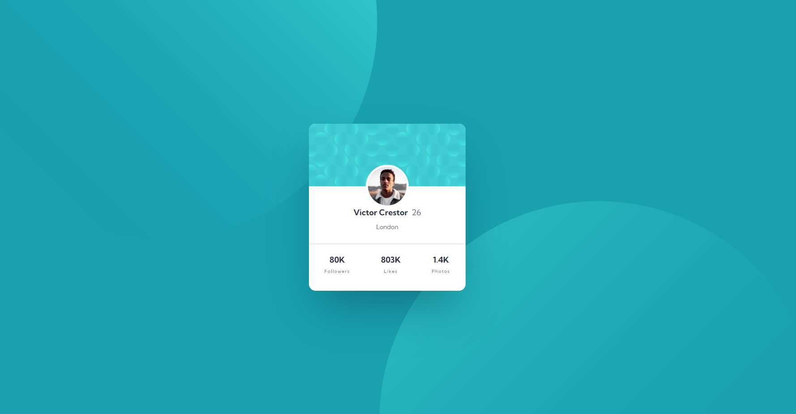

# Frontend Mentor - Profile card component solution

This is a solution to the [Profile card component challenge on Frontend Mentor](https://www.frontendmentor.io/challenges/profile-card-component-cfArpWshJ). Frontend Mentor challenges help you improve your coding skills by building realistic projects.

## Table of contents

- [Overview](#overview)
  - [Screenshot](#screenshot)
  - [Links](#links)
- [My process](#my-process)
  - [Built with](#built-with)
  - [What I learned](#what-i-learned)
  - [Useful resources](#useful-resources)
- [Author](#author)

## Overview

### Screenshot

### Links

- Solution URL: [Profile-card-component](https://github.com/lashasuxa/Main-Profile-Card)
- Live Site URL: [Profile-card-component](https://lashasuxa.github.io/Main-Profile-Card/)

## My process

### Built with

- Semantic HTML5 markup
- CSS custom properties
- Background positioning
- Overflow
- Mobile-first workflow

### What I learned

Basic HTML CSS
Managing multiple background image positioning
Using overflow in CSS

### Useful resources

https://developer.mozilla.org/en-US/docs/Web/CSS/background-position

## Author

- Linkedin - [Lasha Sukhashvili](https://www.linkedin.com/in/lasha-sukhashvili-337034150/)
- Github - [lashasuxa](https://github.com/lashasuxa)
